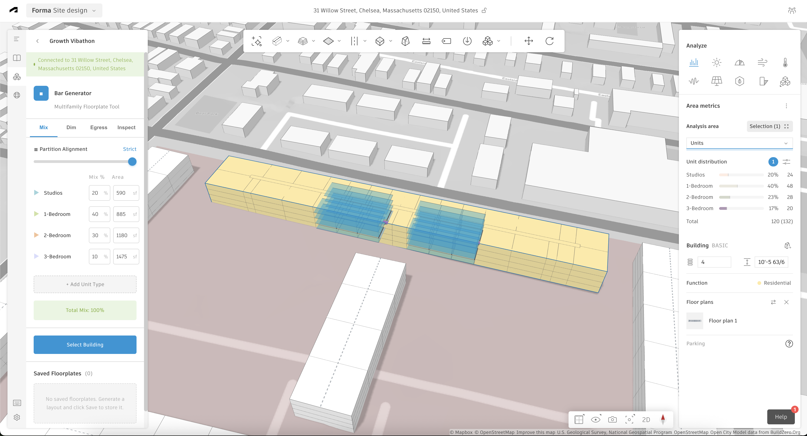
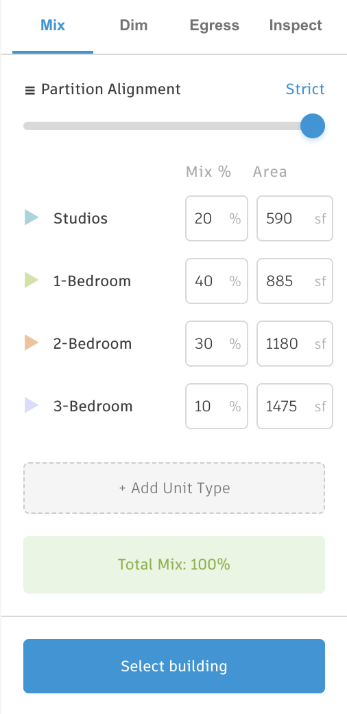
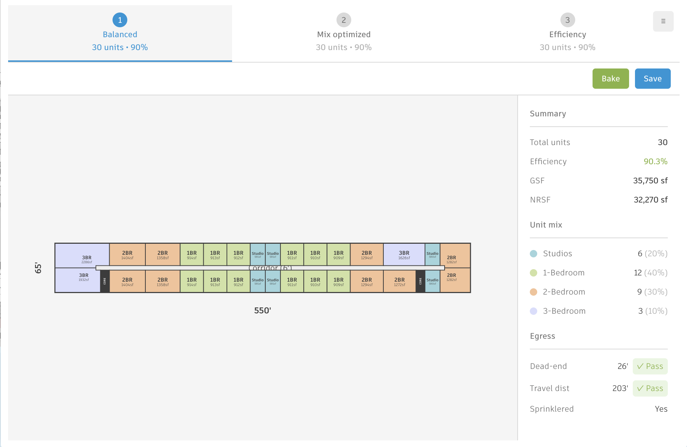

# Floorplate Generator for Autodesk Forma

An automated apartment layout generation tool for **US multifamily residential buildings**. Built as an extension for [Autodesk Forma](https://www.autodesk.com/products/forma).



*Automatically generated apartment layouts baked as native Forma buildings with unit subdivisions*

> **About This Project**
>
> This extension was developed by an Autodesk employee **without an engineering background**, learning how to vibecode (AI-assisted coding). It's shared openly to benefit:
>
> - **AEC professionals** who want to build Forma extensions to solve their own specific, local problems
> - **Designers, engineers, and PMs** looking for inspiration to conduct **product discovery interviews** with quick, working prototypes
>
> This is not production-grade software. It's a learning project and a reference implementation that demonstrates what's possible when combining domain knowledge with AI-assisted development.

## What It Does

Select a building in Forma, configure your unit mix, and instantly generate three optimized apartment layouts applying US building codes (IBC egress, travel distances) and US unit standards (square feet, typical apartment sizes).

- **3 Layout Options** -- Balanced, Mix-Optimized, and Efficiency-Optimized strategies generated simultaneously
- **Building Code Compliance** -- Validates egress requirements (travel distance, dead-ends, common paths)
- **Dynamic Unit Types** -- Configure any number of unit types with custom sizes and properties
- **Smart Defaults** -- Automatically calculates optimal unit properties based on area
- **Complex Buildings** -- Handles L, U, V-shaped buildings with wing detection
- **Cloud Storage** -- Save and restore floorplate designs
- **Bake to Building** -- Convert layouts to native Forma building elements with unit subdivisions

| Unit Mix Configuration | Generated Floorplate |
|:---:|:---:|
|  |  |
| Configure unit types, percentages, and areas | Compare three strategies with real-time metrics |

## Quick Start

**Prerequisites:** [Node.js](https://nodejs.org/) v18+ and an [Autodesk Forma](https://www.autodesk.com/products/forma) account with extension development access.

```bash
git clone https://github.com/DanielGameiroAutodesk/floorplate-generator.git
cd floorplate-generator
npm install
npm run dev
```

Then in Forma: **Extensions** > **Developer Tools** > add `http://localhost:5173` > select a building.

## Usage

1. **Select a Building** in your Forma project
2. **Configure Unit Mix** (MIX tab) -- set unit types, target percentages, and areas
3. **Set Dimensions** (DIM tab) -- adjust corridor width and core placement
4. **Configure Egress** (EGRESS tab) -- set sprinkler status and distance limits
5. **Generate** -- click "Generate" to create 3 layout options
6. **Review & Select** -- compare metrics and pick your preferred option
7. **Save or Bake** -- save the design or convert to a native Forma building

Toggle **Auto-Generate** after your first generation to regenerate layouts automatically when parameters change.

## Project Structure

```
src/
  algorithm/    # Core generation logic (independent of Forma SDK)
  extension/    # Forma UI, panels, managers, state, baking
  geometry/     # Reusable geometric utilities (point, line, polygon, rectangle)
  types/        # Shared TypeScript type definitions
docs/           # Architecture, algorithm, API reference, guides
examples/       # Minimal (~100 lines), custom-units, baking examples
```

See [docs/ARCHITECTURE.md](docs/ARCHITECTURE.md) for detailed module structure and design decisions.

## Development

| Command | Description |
|---------|-------------|
| `npm run dev` | Start development server with hot reload |
| `npm run build` | Compile TypeScript to JavaScript |
| `npm run build:extension` | Build production extension bundle |
| `npm test` | Run all 170+ tests |
| `npm run test:watch` | Run tests in watch mode |
| `npm run test:coverage` | Run tests with coverage report |
| `npm run lint` | Run ESLint |
| `npm run clean` | Remove build artifacts |

## Algorithm Overview

The floorplate generator uses a 7-phase pipeline:

1. **Footprint Analysis** -- extract building geometry, detect shape (rectangular, L, U, V)
2. **Corridor Placement** -- create central double-loaded corridor
3. **Core Placement** -- position elevator/stair cores at ends and wing intersections
4. **Egress Validation** -- ensure all points meet travel distance requirements
5. **Unit Placement** -- distribute units using one of three optimization strategies
6. **Wall Alignment** -- align demising walls across corridor sides
7. **Metrics Calculation** -- compute efficiency, unit counts, and egress compliance

For the full algorithm documentation, see [docs/ALGORITHM.md](docs/ALGORITHM.md).

## For Vibecoders: Building Forma Extensions

This project demonstrates how someone without an engineering background can build functional Forma extensions using AI-assisted coding. Whether you're solving workflow problems or validating product ideas with users, here's what you need to know:

**Key Concepts:**
1. **Forma Embedded View SDK** -- the only production dependency. Provides project data, geometry, selection, 3D rendering, and cloud storage.
2. **Extension Structure** -- two entry points: `index.html` (main panel) and `floorplate-panel.html` (floating preview).
3. **Communication** -- use `Forma.createMessagePort()` for cross-frame messaging between panels.
4. **Rendering** -- use `Forma.render.addMesh()` to display custom geometry in the 3D view.

```typescript
import { Forma } from "forma-embedded-view-sdk";

async function getSelectedBuildingFootprint() {
  const selection = await Forma.selection.getSelection();
  if (selection.length === 0) return null;

  const path = selection[0];
  const triangles = await Forma.geometry.getTriangles({ path });
  return processFootprint(triangles);
}
```

For a quick-start ~100 line example, see [examples/minimal/](examples/minimal/). For the complete guide, see [docs/FORMA_EXTENSION_GUIDE.md](docs/FORMA_EXTENSION_GUIDE.md).

## Documentation

Full documentation is available in the [docs/](docs/) directory:

- [Architecture Overview](docs/ARCHITECTURE.md) -- system design and module structure
- [Algorithm Deep Dive](docs/ALGORITHM.md) -- how the generation algorithm works
- [API Reference](docs/API.md) -- types, functions, and constants
- [Baking Workflow](docs/BAKING_WORKFLOW.md) -- converting layouts to native Forma buildings
- [Forma Extension Guide](docs/FORMA_EXTENSION_GUIDE.md) -- building Forma extensions
- [Troubleshooting](docs/TROUBLESHOOTING.md) -- common issues and solutions

## Contributing

We welcome contributions! Please see [CONTRIBUTING.md](CONTRIBUTING.md) for guidelines on getting started, code style, and the pull request process.

## License

This project is licensed under the MIT License -- see the [LICENSE](LICENSE) file for details.

## Acknowledgments

Built on [Autodesk Forma](https://www.autodesk.com/products/forma). Developed using AI-assisted coding (vibecoding) with Claude. Created to support the vibecoding community in building functional prototypes for product discovery.

## Resources

- [Autodesk Forma Documentation](https://help.autodesk.com/view/FORMA/ENU/)
- [Forma Extensions SDK](https://aps.autodesk.com/en/docs/forma/v1/overview/)
- [TypeScript Documentation](https://www.typescriptlang.org/docs/)

---

**Questions or feedback?** Open an [issue](https://github.com/DanielGameiroAutodesk/floorplate-generator/issues) or start a [discussion](https://github.com/DanielGameiroAutodesk/floorplate-generator/discussions)!
