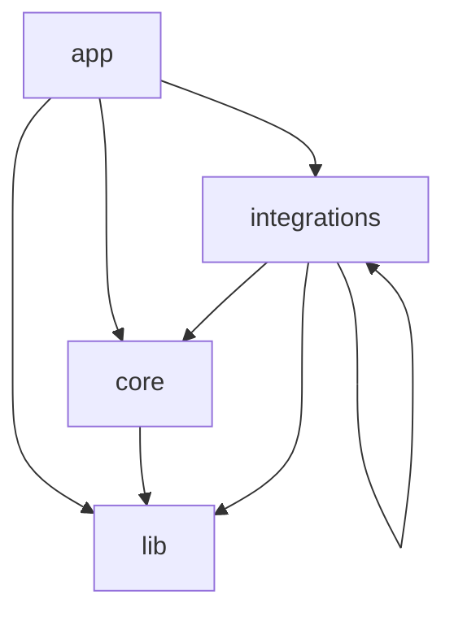

# Design Mode

> [!TIP]
> Need help with designmode? Reach out to
> [#forma-app-designmode](https://autodesk.enterprise.slack.com/archives/C07N4SLBJAX)
> on Slack!

Contains the main design mode for Forma.

`https://app.autodeskforma.eu/designmode/<projectid>/<proposalid>`

<!-- TOC -->

- [Design Mode](#design-mode)
  - [Developer reference](#developer-reference)
    - [Structure of the codebase](#structure-of-the-codebase)
    - [Testing](#testing)
      - [Initializing the app with state](#initializing-the-app-with-state)
    - [URLFlags and LaunchDarkly flags](#urlflags-and-launchdarkly-flags)
  - [Running the code](#running-the-code)
    - [Running the code locally](#running-the-code-locally)
    - [Working with locally served web-components](#working-with-locally-served-web-components)
      - [Multiple Preact applications](#multiple-preact-applications)
  - [State handling with Signals](#state-handling-with-signals)
    - [Reactive methods](#reactive-methods)
      - [A note about returning new computed instances](#a-note-about-returning-new-computed-instances)

## Developer reference

Please read this before contributing to Design Mode

### Structure of the codebase

> **NOTE: Work in progress**
>
> This folder structure is not yet implemented, but we are moving towards it. Please add all new code according to
> this overview and move existing code going forward

| Folder         | Description                                                                                        |
| -------------- | -------------------------------------------------------------------------------------------------- |
| `app`          | Contains the application frame and the wiring of various plugins, initializations, etc.            |
| `core`         | Contains all core functionality to make design mode work                                           |
| `i18n`         | Contains the internationalization setup for the app                                                |
| `integrations` | Contains domain specific code which is not part of the core of design mode                         |
| `lib`          | Shared folder to put all reusable stuff in. Files in this folder cannot import from outside of lib |



### Testing

See examples on how to test function, hooks and components in [src/tests/examples](src/tests/examples)

#### Initializing the app with state

1. Load the app with query param `?debug`
2. Press "Log fixture data" in right down corner
3. Copy the logged object from console into fixture file
4. See [src/app/debug-ui/fixture.test.ts](src/app/debug-ui/fixture.test.ts) for how to use the fixture

### URLFlags and LaunchDarkly flags

URL flags that are used to conditionally render experimental features in the app.

Remember to use `?url-param` if having no existing params, or `&url-param` to append the param.

[See Airtable for the current list.](https://airtable.com/invite/l?inviteId=invfMPjg2AthzFBsf&inviteToken=f532c93a76a1236c05f959fd4bcc1281733dd90f486a6ffa618ebeb305ede800&utm_medium=email&utm_source=product_team&utm_content=transactional-alerts)

## Running the code

### Running the code locally

**Prerequisites**

Setup [`spacemaker-cli`](https://github.com/spacemakerai/spacemaker-cli) minimum version 1.6.3
Create local npmrc file (ref: https://wiki.autodesk.com/pages/viewpage.action?pageId=1586225518)

**Install**

(For more details about setting up PNPM see https://pnpm.io/installation - using corepack will
pick up PNPM version from package.json instead of everyone having their own version of it.)

```bash
corepack enable
pnpm install
```

**_Note: For Windows, run the following command so environment variables are set correctly:_**

```bash
npm config set script-shell bash
```

**Start dev server**

```bash
REGION=eu pnpm start // Will open local.autodeskforma.eu:3000

// or

REGION=us pnpm start // Will open local.autodeskforma.com:3000
```

### Working with locally served web-components

To proxy requests for a web-component, add an entry in `proxyConfigs` in
`vite.config.ts`, similar to the ones that are there for library and proposal
list. In order to proxy to a locally built library start the design mode dev
server with `LOCAL_LIBRARY=1 pnpm start`.

Similarily for other components (non exhaustive list):

- `LOCAL_PROPOSAL_LIST=1 REGION=eu pnpm start` Uses local proposal list on https://local.autodeskforma.eu:3001/

#### Multiple Preact applications

Two Preact applications cannot run with HMR at the same time,
due to how the `prefresh` library assumes exclusive access
to `window`.

To disable `prefresh` run all dev servers with `SKIP_PREFRESH=1`,
except the one you want HMR to be active in.

Add similar code as in `vite.config.ts` in your Vite app if needed
to use the flag.

Additionally, in your `vite.config.ts` you will need to specify
an explicit HMR port, so your browser will connect to the
proper server:

```js
const config = {
  server: {
    port: 3003,
    hmr: {
      // Ensure HMR bypasses proxy used with host application.
      port: 3003,
    },
  },
}
```

## State handling with Signals

We use [Preact signals](https://github.com/preactjs/signals)
as the primary mechanism to deal with state.
Some old code still leverages Recoil, but we are moving away from that
as it's no longer actively maintained.

**Conventions:**

- Variables that represents signals should preferably be suffixed
  with `Signal`. E.g. `selectionSignal`.
  This helps us to distinguish signals from regular variables.

  We could consider relaxing this if we do stricter linting that
  would pick up mistakes such as `if (hasSelection)` which should
  instead be `if (hasSelection.value)`.

- Methods that subscribe to state (i.e. `selectionSignal.value`) should
  preferably be suffixed with `Reactive`. E.g. `isInBaseReactive`.
  See below for details.

<details>
<summary>More insight on Signals usage</summary>

### Reactive methods

Methods that access a signal value has to deal with the question of
subscribing or not subscribing. In most cases this is a question
that the caller should deal with, and in our cases we often access
global signals which is a side-effect of the method.

For the caller these side-effects should be clear that is
happening, and the caller should be able to know when to rerun
it when signal values changes.

There's a few alternatives to deal with this, such as passing
in values as dependencies. With signals the preferred way is to subscribe
to signals when they are needed and accessed.

As subscribing to a signal is another kind of side-effect, we
benefit from making this explicit, hence the convention to use
`Reactive` suffix. This reduces overall cognitive load in understanding
the application flow.

This way the caller can ultimately decide to subscribe or not,
by opting out if necessary by using `untracked`.

#### A note about returning new computed instances

It's tempting to think that you can return a new computed instance
from a method as an alternative mechanism:

```ts
const someSignal = signal("foo")
function getState(key: string) {
  return computed(() => {
    console.log("reading state...")
    // read state here...
    return someSignal.value + key
  })
}
```

So that it would become even more explicit for the caller:

```ts
effect(() => {
  const abcValue = getState("abc").value
  console.log(abcValue)
})
```

However this would print three times to console in the example above when state
changes. This is because the first computed instance need to rerun before it
know that the output changes, and then it triggers the outer effect
to rerun, and the effect would create another computed instance that also
need to run.

With our preferred pattern it looks like this instead:

```ts
const someSignal = signal("foo")
function getStateReactive(key: string) {
  console.log("reading state...")
  // read state here...
  return someSignal.value + key
}
effect(() => {
  const abcValue = getStateReactive("abc")
  console.log(abcValue)
})
```

</details>
